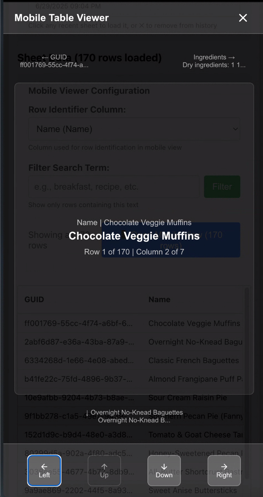

# GSX2JSON - Google Sheets **Mobile Viewer**

## Why you'll love it

Send anyone a Google Sheet ID (or full URL) and this project spins up a gorgeous, touch-friendly **mobile viewer**:

* 📱   Full-screen, swipeable cell-by-cell explorer
* 👆   Gesture navigation (swipe ← / ↑ / → / ↓)
* 🔍   Instant filter + row-identifier selection before launch
* 🕶️   Auto-adapts to dark overlays / small screens
* 💾  Remembers your last five sheets for 1-click access
* 🔐  Works with public or private sheets (API-key/OAuth ready)

> The original GSX2JSON service that returns JSON is still here — now it powers the viewer under the hood.  If you only need raw JSON jump to **"Programmatic API"** below.

---

## Quick Start (Mobile Viewer)

1. `npm install`
2. Add your Google Sheets API key to **.env**
   ```bash
   echo "GSHEETS_API_KEY=YOUR_KEY" > .env
   ```
3. `npm run build && npm start`
4. Open **http://localhost:5005**
5. Paste any Sheet URL or ID → Pick a sheet tab → *(optional)* set filter / row-identifier → **Open Mobile View**

---

## Screenshots

| Load screen | Configuration | 
|-------------|---------------|
|  |  |

---

## Features in depth

### Mobile Viewer
* Flexible font with `clamp()` so even huge cells fit
* Safe-area aware on iOS Safari (bottom toolbar)
* Header, context previews, navigation buttons—all sized to avoid overlap

### Recent-sheet history
* Cookie-based list (max 5) with titles fetched from Spreadsheet metadata
* One-click load / ✕ remove

### Configuration step
* Choose **Row Identifier** column (used in contextual breadcrumbs)
* Free-text **Filter** to show only matching rows

---

## Advanced: Programmatic JSON API

The Express backend still exposes the simplified GSX2JSON endpoint:

```http
GET /api?id=<SHEET_ID>&sheet=<SHEET_NAME>&api_key=<YOUR_KEY>
```
Returns:
```json
{
  "title": "My Sheet",
  "columns": { ... },
  "rows": [ ... ]
}
```
Full parameter list & examples are in **docs/API.md**.

---

## Roadmap
* OAuth flow for private sheets (token instead of API key)
* Dark-mode automatic theme
* Offline cache / PWA wrapper

---

## License
MIT © 2025 Alex J. Wall — includes portions of the original gsx2json by **Nick Moreton**
